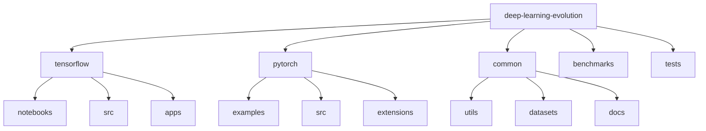

# Deep Learning Evolution 🚀

[](https://www.python.org/downloads/)
[](https://tensorflow.org/)
[](https://pytorch.org/)
[](https://developer.nvidia.com/cuda-toolkit)
[](LICENSE)
[](CONTRIBUTING.md)

> **Deep-Learning Evolution** combines both **TensorFlow** and **PyTorch** projects into a single, cohesive repository. From foundational neural networks to custom CUDA kernels and distributed training systems, you’ll find memory‑efficient training techniques, advanced GPU optimizations, and production‑ready deployments for real‑world AI applications.

---

## 📑 Table of Contents
- [✨ Features](#-features)
- [📁 Project Structure](#-project-structure)
- [🔧 Prerequisites](#-prerequisites)
- [📦 Installation](#-installation)
- [🚀 Quick Start](#-quick-start)
  - [TensorFlow Examples](#tensorflow-examples)
  - [PyTorch Examples](#pytorch-examples)
- [📚 Documentation](#-documentation)
  - [Models](#models)
  - [GPU Optimization](#gpu-optimization)
  - [Benchmarks](#benchmarks)
- [🤝 Contributing](#-contributing)
- [📌 Versioning](#-versioning)
- [✍️ Author](#-author)
- [📝 Citation](#-citation)
- [📄 License](#-license)
- [🙏 Acknowledgments](#-acknowledgments)

---

## ✨ Features

1. **Comprehensive Framework Coverage**  
   - TensorFlow 2.14+ and PyTorch 2.2+ examples under one roof.

2. **Custom Training Pipelines**  
   - Efficient data loading, augmentation, and custom training loops.

3. **Advanced GPU & CUDA Optimizations**  
   - Memory‑efficient backprop, kernel fusion, and multi‑GPU data parallelism.

4. **Distributed Training**  
   - PyTorch’s `DistributedTrainer` and TensorFlow’s MirroredStrategy for large‑scale HPC setups.

5. **Production‑Ready Models**  
   - Demonstrations of how to package and deploy models with Docker, Streamlit, or other tools.

6. **Comprehensive Documentation & Tests**  
   - Detailed notebooks, examples, and unit tests in both frameworks.

---

## 📁 Project Structure

Depending on your final layout, you might organize your repo as follows:



<details>
<summary>Click to expand possible directory structure</summary>

```plaintext
deep-learning-evolution/
├── tensorflow/
│   ├── notebooks/           # Jupyter notebooks for TF experiments
│   ├── src/                 # TF source code (models, data, utils, cuda)
│   ├── apps/                # Demo or production apps (e.g., Streamlit)
│   └── ...
├── pytorch/
│   ├── examples/            # PyTorch example scripts
│   ├── src/                 # PyTorch source (models, training utils)
│   ├── extensions/          # Custom CUDA kernels/extensions
│   └── ...
├── common/
│   ├── utils/               # Shared utility scripts
│   ├── datasets/            # Shared data loaders or references
│   └── docs/                # Additional documentation
├── benchmarks/              # Performance comparisons across frameworks
├── tests/                   # Unit tests for TF and PT code
├── requirements.txt         # Dependencies
└── README.md                # Main documentation
```
</details>

**Tip**: You can keep separate `requirements-tf.txt` and `requirements-pt.txt` if you prefer splitting dependencies.

---

## 🔧 Prerequisites

- **Python** 3.8+
- **CUDA** 11.8+
- **TensorFlow** 2.14+  
- **PyTorch** 2.2+  
- **NVIDIA GPU** with compute capability 6.0+  
- **(Optional)** C++ compiler for building custom CUDA extensions (e.g., PyTorch’s extension modules)

---

## 📦 Installation

1. **Clone this repository:**

   ```bash
   git clone https://github.com/BjornMelin/deep-learning-evolution.git
   cd deep-learning-evolution
   ```

2. **Set up a virtual environment:**

   ```bash
   python -m venv venv
   source venv/bin/activate  # Linux/Mac
   # or
   .\venv\Scripts\activate  # Windows
   ```

3. **Install dependencies:**

   ```bash
   # Single unified requirements:
   pip install -r requirements.txt

   # OR separate for each framework:
   pip install -r requirements-tf.txt
   pip install -r requirements-pt.txt
   ```

4. **(Optional) Build custom CUDA extensions (for PyTorch examples):**

   ```bash
   cd pytorch/extensions/cuda
   python setup.py install
   ```

---

## 🚀 Quick Start

### TensorFlow Examples

```python
# TensorFlow: Basic CNN Example
from tensorflow.src.models import BasicCNN
from tensorflow.src.utils import DataLoader

data_loader = DataLoader('path/to/data')
model = BasicCNN()

model.train(data_loader, epochs=10)
model.evaluate(...)
model.save('saved_model')
```

### PyTorch Examples

```python
# PyTorch: Custom Transformer Example
from pytorch.src import models, training

model = models.TransformerWithCustomAttention(num_heads=8, d_model=512)
trainer = training.DistributedTrainer(model, gpu_list=[0,1])
trainer.train(dataset, epochs=10)
```

> For more demos, see the [notebooks](./tensorflow/notebooks) in `tensorflow/` or the [examples](./pytorch/examples) folder in `pytorch/`.

---

## 📚 Documentation

### Models

| Model                 | Framework      | Description                                 | Performance        | Memory Efficiency |
|-----------------------|----------------|---------------------------------------------|--------------------|-------------------|
| `BasicCNN`            | TensorFlow     | Foundational CNN architecture               | 94% on MNIST       | High              |
| `TransformerBlock`    | TensorFlow     | Custom transformer for NLP                  | BERT-comparable    | Medium            |
| `AdvancedGAN`         | TensorFlow     | Generative adversarial network              | FID: 18.3          | High              |
| `TransformerWithCustomAttention` | PyTorch | Advanced Transformer w/ fused attention  | 95% on GLUE        | High              |
| `ViT`                 | PyTorch        | Vision transformer with optimized attention | 92% on ImageNet    | Medium            |
| `CustomGAN`           | PyTorch        | Memory‑efficient adversarial network        | FID: 12.4          | High              |

---

### GPU Optimization

- **Custom CUDA kernels** for specialized operations  
- **Memory‑efficient training** (gradient checkpointing, fused ops)  
- **Multi‑GPU data parallelism** (PyTorch DDP, TF MirroredStrategy)  
- **Distributed training** for large‑scale HPC  
- **Kernel fusion techniques** to minimize overhead

---

### Benchmarks

| Model                 | Hardware | Framework   | Training Time | Memory Usage | Throughput        |
|-----------------------|---------|------------|---------------|-------------|-------------------|
| Custom BERT           | A100    | PyTorch    | 4.2 hrs       | 16GB        | 1250 samples/sec  |
| ViT                   | V100    | PyTorch    | 6.8 hrs       | 24GB        | 850 samples/sec   |
| ResNet-152            | 3090    | PyTorch    | 2.5 hrs       | 12GB        | 2100 samples/sec  |
| BasicCNN (small)      | 4GB GPU | TensorFlow | 2.3 hrs       | ~2GB        | 900 samples/sec   |
| TransformerBlock      | 8GB GPU | TensorFlow | 5.7 hrs       | ~6GB        | 600 samples/sec   |

(Exact numbers are illustrative; refer to each framework’s benchmarks folder for detailed logs.)

---

## 🤝 Contributing

We welcome all contributions, from bug fixes to new model architectures and GPU kernels.

- [Contributing Guidelines](CONTRIBUTING.md)  
- [Code of Conduct](CODE_OF_CONDUCT.md)  
- [Development Guide](DEVELOPMENT.md)

1. **Fork** this repository  
2. **Create** a new branch  
3. **Commit** your changes  
4. **Open** a Pull Request

---

## 📌 Versioning

We use [SemVer](http://semver.org/) for versioning. For available versions, check the [tags](https://github.com/BjornMelin/deep-learning-evolution/tags).

---

## ✍️ Author

**Bjorn Melin**  
- GitHub: [@BjornMelin](https://github.com/BjornMelin)  
- LinkedIn: [Bjorn Melin](https://linkedin.com/in/bjorn-melin)

Feel free to add additional contributors or maintainers here.

---

## 📝 Citation

If you find this project useful, please cite:

```bibtex
@misc{melin2024deeplearningevolution,
  author = {Melin, Bjorn},
  title = {Deep Learning Evolution: Unified TensorFlow & PyTorch Implementations},
  year = {2024},
  publisher = {GitHub},
  url = {https://github.com/BjornMelin/deep-learning-evolution}
}
```

---

## 📄 License

This project is licensed under the **MIT License**. See the [LICENSE](LICENSE) file for details.

---

## 🙏 Acknowledgments

- **TensorFlow** team for extensive documentation and tooling.  
- **PyTorch** contributors for ongoing innovation.  
- **NVIDIA** for the CUDA toolkit.  
- **Open Source Community** for valuable feedback and inspiration.

---

**Made with 🧠 and ⚡ by Bjorn Melin**
